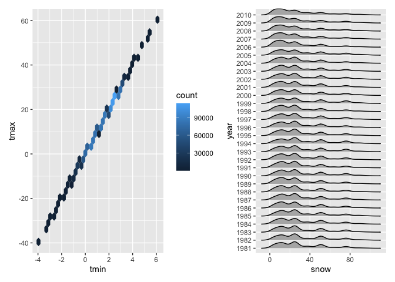

p8105_hw3_fz2328
================
Fengdi Zhang
2022-10-14

## Problem 2

Load, tidy and wrangle the data.

``` r
accel_data = 
      read_csv("dataset/accel_data.csv") %>% 
      janitor::clean_names() %>%
      pivot_longer(
              activity_1:activity_1440,
              names_to = "minute_day",
              names_prefix = "activity_",
              values_to = "activity_counts") %>% 
      mutate(
        week_factor = ifelse(day == "Saturday" | day == "Sunday", "weekend", "weekday"),
        minute_day = as.numeric(minute_day)
      )
```

The resulting dataset includes 6 variables, including activity_counts,
day, day_id, minute_day, week, week_factor. There are 50400 observations
in total.

``` r
accel_data %>%
  group_by(week, day) %>%
  mutate(activity_day_total = sum(activity_counts)) %>% 
  group_by(week, day, activity_day_total) %>% 
  summarize() %>% 
  pivot_wider(
    names_from = "day",
    values_from = "activity_day_total") %>% 
  select(week, Monday, Tuesday, Wednesday, Thursday, Friday, Saturday, Sunday) %>% 
  knitr::kable(digits = 1)
```

| week |   Monday |  Tuesday | Wednesday | Thursday |   Friday | Saturday | Sunday |
|-----:|---------:|---------:|----------:|---------:|---------:|---------:|-------:|
|    1 |  78828.1 | 307094.2 |    340115 | 355923.6 | 480542.6 |   376254 | 631105 |
|    2 | 295431.0 | 423245.0 |    440962 | 474048.0 | 568839.0 |   607175 | 422018 |
|    3 | 685910.0 | 381507.0 |    468869 | 371230.0 | 467420.0 |   382928 | 467052 |
|    4 | 409450.0 | 319568.0 |    434460 | 340291.0 | 154049.0 |     1440 | 260617 |
|    5 | 389080.0 | 367824.0 |    445366 | 549658.0 | 620860.0 |     1440 | 138421 |

It seems that the activity counts are much lower in the first 2 days in
the first week and during the weekends in the last 2 weeks. Otherwise,
there is no obvious trend.

``` r
accel_data %>% 
  group_by(week, day) %>% 
  ggplot(aes(x = minute_day, y = activity_counts, color = day)) + 
  geom_point(alpha = .5 ) 
```

<!-- -->

According to the graph, wee can see that this patient tends to have more
activities at certain times during the days, such as 650mins/10:50am,
1000mins/4:40pm, and 1250mins/8:50pm.

## Problem 3

First, import the data

``` r
library(p8105.datasets)
data("ny_noaa")
```

There are 50400 observations in total. The dataset includes 7 variables,
including activity_counts, day, day_id, minute_day, week, week_factor.
There are missing values in these variables: prcp, snow, snwd, tmax,
tmin. The missing values would cause problems when summarizing the
variables statistics, restructuring variables, and so on.

Let’s tidy the data first

``` r
ny_noaa = ny_noaa %>% 
  separate(date, into = c("year", "month", "day"), sep = "-")

ny_noaa = ny_noaa %>% 
  mutate(
    year = as.numeric(year),
    month = as.numeric(month),
    day = as.numeric(day),
    tmax = as.numeric(tmax),
    tmin = as.numeric(tmin)
  ) %>% 
  mutate(
    prcp = 0.1*prcp, 
    tmax = 0.1*tmax,
    tmin = 0.1*tmax
  )
```

Now, year, month and day are separate variables. Precipitation, snowfall
and snow depth have a unit of mm. Temperatures have a unit of degrees C.

The most commonly observed values for snowfall is 0. This is because New
York only have a few days of snowing each year. The other reason can be
that there were about one half of the stations report precipitation
only.

Now, let’s make a two-panel plot showing the average max temperature in
January and in July in each station across years.

``` r
ny_noaa %>% 
  filter(month == 1 | month == 7) %>% 
  group_by(id, year, month) %>% 
  mutate(tmax_mean = mean(tmax, na.rm = TRUE)) %>% 
  ggplot(aes(x = year, y = tmax_mean, group = id)) + 
  geom_line(alpha = .5) + 
  facet_grid(. ~ month)
```

<!-- -->

In general, the average max temperature in July is significantly higher
than the average max temperature in January. The max temperature in July
has a narrower range than the max temperature in January. In January,
there are a bunch of outliers above and below the average of tmax. In
July, most outliers lie below the average of tmax. Each station has
similar temperature change patterns.

Now, let’s make a two-panel plot showing (i) `tmax` vs `tmin` for the
full dataset; (ii) make a plot showing the distribution of snowfall
values greater than 0 and less than 100 separately by year

``` r
A = ny_noaa %>% 
  ggplot(aes(x = tmin, y = tmax, color = month)) + 
  geom_hex()
 
B = ny_noaa %>%
  filter(snow > 0 & snow < 100) %>% 
  ggplot(aes(x = snow, fill = year, group = year)) + 
  geom_density(alpha = .4, adjust = .5) 

A/B
```

<!-- -->
